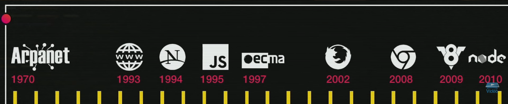

# Anotações do curso de JS
Ministrado pelo prof. Gustavo Guanabara.  
[Curso de JS do Curso em Vídeo](https://www.youtube.com/playlist?list=PLHz_AreHm4dlsK3Nr9GVvXCbpQyHQl1o1)

## Cliente x Servidor
<p align="center">
     <br /> <br />
    Fonte da imagem: Autoria própria (2020). <br />
    Créditos do designers autores das ilustrações na própria imagem.
</p>
O cliente envia uma requisição para acessar o conteúdo (através da URL).  
Algum servidor de DNS *(domain name server)* recebe a requisição e associa a URL a um IP e envia a requisição aos servidores com aquele endereço IP.  
Algum servidor disponível que tenha aquele endereço IP recebe e processa a requisição, devolvendo uma cópia do conteúdo requisitado ao navegador do cliente.  

**O JS surgiu para atuar no cliente, mas hoje também funciona no ambiente dos servidores.**

## Website, HTML, CSS e JS
HTML -> Organiza o conteúdo  
CSS -> Organiza a **disposição** do conteúdo e **estiliza**  
JS -> interage diretamente com o usuário de acordo com as ações dele  
  
HTML e CSS não rodam nada. (Exemplo de Brian Holt: imagine o seu artigo, o seu artigo não executa nada, ele apenas dispõe o conteúdo)  
  
Com aumento da velocidade da internet o JavaScript se tornou mais popular e mais usado, pois antigamente com as baixas velocidades de internet (100kb/s) os sites usavam apenas HTML e às vezes CSS, pois assim o conteúdo chegava mais facilmente aos usuários.  
O Youtube é diretamente dependente do JavaScript.  
## Linha do tempo
<p align="center">
     <br />
    Fonte da imagem: Curso de JS do Curso em Vídeo - Aula 02.
</p>

**1970** - DARPA, MIT e UC criaram a Arpanet com fins científicos e acadêmicos.  
A Arpanet se transformou na Internet.  
**1993** - Tim criou HTML, HTTP e WWW. Surge o MOSAIC, criado pela NCSA.  
**1994** - Surge a NetScape.  
**1995** - Godzilla -> Mozilla.  
NetScape cria o MOCA.  
MOCA ia se chamar LiveScript, mas devido a popularidade de Java, chamaram de JavaScript como jogada de marketing.  
Microsoft cria o JScript após o sucesso do JavaScript.  
Windows 95 passa a conter nativamente o Internet Explorer, que foi construído sobre o falecido MOSAIC após a Microsoft comprá-lo.  
**1997** - A NetScape padroniza o JavaScript para evitar o plágio. A ECMA padroniza o JS e o JavaScript passa a se chamar ECMAScript.  
**2002** - NetScape faliu e criou o Mozilla Firefox.  
**2008** - Surge o Google Chrome.  
**2009** - Surge a V8 que roda JavaScript nos navegadores do Chrome.  

## Chrome e V8
O V8 é um motor criado pela Google para interpretar os códigos JS dentro do ambiente do Google Chrome.

## Nodejs
Como o motor V8 feito pelo Chrome é de código livre, o Nodejs foi construído se baseando no V8, já que é um interpretador que funciona para o Chrome, pode ser adaptado para outros ambientes e é justamente isso que foi feito com o Nodejs. Da mesma forma que o Chrome utiliza o V8, o Nodejs cria um ambiente em que é possível interpretar códigos JS no servidor.

## Concatenação de variáveis em JS
Existem dois jeitos, o já comum:  
  
``` 'O aluno ' + nome + 'com ' + idade + 'tirou a nota ' + nota```
  
Ou a nova forma:  
  
``` `O aluno ${nome} com ${idade} tirou a nota ${nota}` ```
  
## Árvore DOM
<div align="center">
     <br />
    Créditos da imagem: Curso de JS do Curso em Vídeo - Aula 09.
</div>